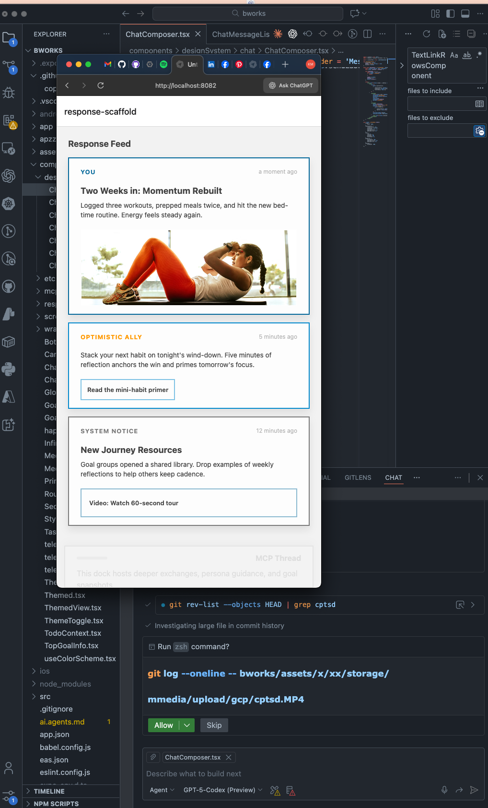

# 🤖 The BOTWorks Project

**An MCP-Powered App Built in Expo + Azure Container Apps**  
A unified framework where agents, design, and logic come together — powered by the **MO Concept** and driven from a single structured file.

[📍 View Progress & Code](https://github.com/BOT-Digital/BOTWorks-Project.git)

---

---

## 🚧 Project Status: Active — Azure MCP Integration Sprint

BOTWorks is an AI-guided mobile app framework based on **Multi-Agent Collaborative Prompting (MCP)** — a system where agents collaborate to steer every screen. We’re currently finishing the Azure Container Apps deployment, wiring the new `AzureOpenAIService`, and refreshing test coverage ahead of the next build window.

Latest internal docs:

- [dev.agents.md](dev.agents.md) — week-by-week agent backlog, deployment checklists.
- [dev.test.md](dev.test.md) — preflight steps and regression coverage for the next session.

---

## 💡 What Is BOTWorks?

BOTWorks is built around a single principle:  
> **Everything — from goals to UI to agent prompts — is structured in one file.**

The entire experience is scaffolded from a single YAML definition called the **MO Concept**. This includes:

- Agent behavior & conversation paths  
- User goal intake & triage  
- Interface layout & emotional design logic  
- Visual theming & spacing systems  

It’s not a typical app. It’s a **living system**, where human intention meets structured agent support.

---

## 🧠 The MO Concept (Framework Pillars)

BOTWorks runs on a modular logic file that defines:

- **Connection Constant** — Core behavioral model (Action, Power, Change)  
- **Experience Pillars** — Emotional feedback loops and choice mechanics  
- **Goal Blueprinting** — Structured intent capture with evolving task states  
- **Response Interfaces** — Sliders, chat panels, and micro-animated inputs  
- **Visual System** — Sharp-edged UI with themed tokens and motion layers  
- **Conversation Patterns** — High / Low / Neutral agent guidance strategies  
- **Build Phases** — Roadmapped in four stages from scaffold to polish  

---

## 🛠️ Tech Stack

- **Frontend**: [Expo (React Native)](https://expo.dev)  
- **State Management**: Zustand  
- **Animations**: Reanimated  
- **Backend**: .NET MCP service deployed via [Azure Container Apps](https://learn.microsoft.com/azure/container-apps/)  
- **AI / MCP Layer**: Azure OpenAI + MO Concept YAML configuration  

---

## 📅 Build Roadmap

| Phase | Focus | Status |
|-------|-------|--------|
| 1     | Route scaffolding & shared component stubs | ✅ Completed |
| 2     | Core UI (ChatBubble, slider, collapsible panels) | ⚙️ In Progress |
| 3     | Azure wiring & MCP agent integration | 🚚 In Flight |
| 4     | Visual/gesture polish + reflection loop testing | 🔜 Next |

---

## 🤝 How to Get Involved

If you're interested in:

- Building AI agents with structured prompts  
- Creating single-file, multi-agent apps  
- Exploring collaborative UX powered by logic and emotion  

...I'd love to connect.

Feel free to fork the repo, open an issue, or drop a line. If you want to help ship the Azure sprint, start by reviewing the docs above and running through the `dev.test.md` checklist locally.

---

## 🔗 Project Repo

[👉 BOTWorks on GitHub](https://github.com/BOT-Digital/BOTWorks-Project.git)

---

*BOTWorks — because agents shouldn’t just assist. They should build with you.*
